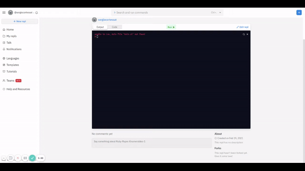

# Enumerables

## Table of Contents

* [About the Project](#about-the-project)
* [Built With](#built-with)
* [Contributing](#contributing)
* [Contact](#contact)
* [Acknowledgements](#acknowledgements)


<!-- ABOUT THE PROJECT   -->
## About The Project
In this project, we develop the already existing Ruby enumerable methods such as #each and many others, using our existing knowledge of important concepts in Ruby. 

## Screenshot

<p align="center">
  
</p>

<p align="center">

</p>

### Built With

* [RUBY](https://github.com/billodiallo/project2-enumerable/tree/feature-enum)

## Contributing

Contributions are what make the open source community such an amazing place to be learn, inspire, and create. Any contributions you make are **greatly appreciated**.

## Getting Started
This is an example of how you may give instructions on setting up your project locally. Modify this file to match your project, remove sections that don't apply. For example: delete the testing section if the currect project doesn't require testing.

- To get a local copy up and running follow these simple example steps.

- Clone this repository with git clone ```https://github.com/sergiocortessat/Ruby-Rspec-Enumerables.git``` using your terminal or command line.
- Change to the project directory by entering :
```cd Ruby-Rspec-Enumerables``` in the terminal .
- run the command ```ruby Ruby-Rspec-Enumerables```

## Prequisites

Ruby installed on your local machine.
Terminal or similar to execute the program.

## Testing
In this project the testing was done using RSpec to test all enumerable  methods.

## Install
- In a terminal window type gem install rspec
- Once rspec install has finished, type rspec --init
- You will see a folder spec and a file .rspec
- Inside spec folder you'll see a spec_helper.rb file.

## Run
We have already created rspec-testing files called logic.rb, and settings.rb.
- go to the folder inside your terminal type rspec
- If all test pass you will see:
 `26 examples, 0 failures` for spec_enumerable.rb
 
<!-- CONTACT -->
## Contact

## Authors

👤 **Billo Diallo**

- GitHub:[@billodiallo](https://github.com/billodiallo)
- Twitter: [@BilloDi83547008](https://twitter.com/BilloDi83547008)
- Linkedin:[@mabillodiallo](https://www.linkedin.com/in/mabillodiallo/)

👤 Sergio Cortes Satizabal

- Github: [@sergiocortessat](https://github.com/sergiocortessat)
- Twitter: [@sergiocortessat](https://twitter.com/sergiocortessat)


Project Link: [Bubble Sort Ruby](https://github.com/billodiallo/bubble_sort/tree/feature-b)


<!-- ACKNOWLEDGEMENTS -->
## Acknowledgements

* [Microverse](https://www.microverse.org/)


